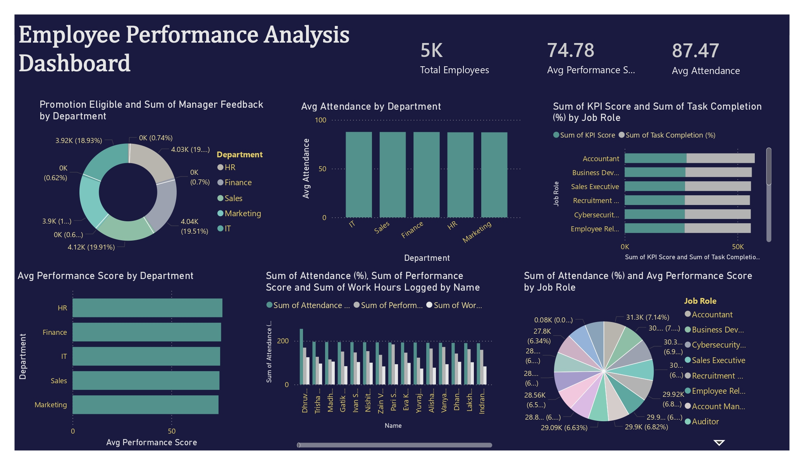

# Employee Performance Analysis Dashboard

## Project Overview

This Power BI dashboard provides a comprehensive analysis of employee performance, attendance, KPI achievement, task completion, and promotion readiness across departments and job roles.

The dashboard helps HR teams, managers, and business leaders monitor workforce productivity, identify high-performing employees, and support talent management decisions through data-driven insights.

---

## Dashboard Preview

---

## Key Metrics

| KPI | Value |
|------|--------|
| Total Employees | 5,000 |
| Average Performance Score | 74.78 |
| Average Attendance | 87.47% |

---

## Dashboard Features

### 1. Promotion Eligibility Analysis
Evaluates promotion-ready employees across departments:

- HR
- Finance
- Sales
- Marketing
- IT

Helps management identify talent for career advancement opportunities.

---

### 2. Department-wise Attendance Analysis
Tracks average attendance rates across departments to measure employee engagement and workforce discipline.

---

### 3. KPI Score vs Task Completion
Compares:

- KPI Achievement Scores
- Task Completion Percentages

across various job roles to assess operational effectiveness.

---

### 4. Performance Score by Department
Analyzes departmental performance and identifies teams with strong productivity levels.

---

### 5. Employee-Level Performance Analysis
Measures individual employee metrics including:

- Attendance Percentage
- Performance Score
- Work Hours Logged

Supports performance reviews and workforce planning.

---

### 6. Job Role Performance Distribution
Provides insights into attendance and performance trends across roles such as:

- Accountant
- Business Development Executive
- Cybersecurity Analyst
- Sales Executive
- Recruiter
- Employee Relations Specialist
- Auditor
- Account Manager

---

## Key Insights

### Workforce Performance
- Average employee performance score stands at **74.78**.
- Attendance levels remain consistently high across departments.

### Department Analysis
- HR, Finance, IT, Sales, and Marketing show similar performance levels, indicating balanced workforce productivity.

### Talent Management
- Promotion eligibility metrics help identify employees with strong performance potential.
- KPI achievement closely aligns with task completion rates.

### Employee Engagement
- High attendance rates contribute positively to overall employee performance.
- Employees with consistent work-hour contributions tend to achieve better KPI scores.

---

## Business Objectives

- Monitor employee productivity
- Improve workforce performance
- Support promotion decisions
- Track attendance and engagement
- Enhance talent management strategies
- Enable data-driven HR decisions

---

## Business Value

This dashboard helps organizations:

- Improve employee performance monitoring
- Identify top-performing employees
- Optimize workforce planning
- Increase employee engagement
- Support succession planning
- Enhance HR analytics capabilities

---

## Tools & Technologies

- Power BI
- DAX
- Power Query
- Excel / CSV Dataset
- Data Modeling
- Human Resource Analytics

---

## Skills Demonstrated

- HR Analytics
- Employee Performance Analysis
- Workforce Analytics
- KPI Development
- Dashboard Design
- DAX Measures
- Data Modeling
- Power Query
- Executive Reporting

---

## Author

Yashwanth Katuru

Aspiring Data Analyst | Power BI Developer | Business Intelligence Enthusiast
